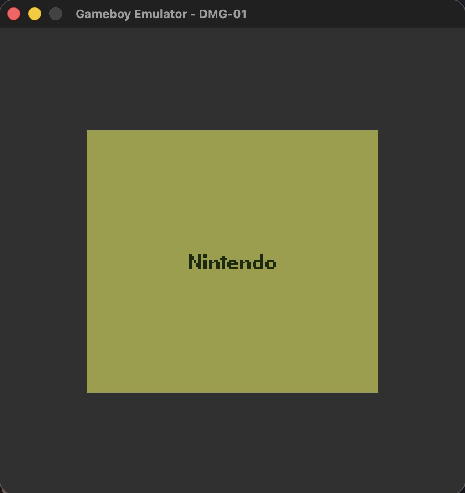
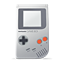
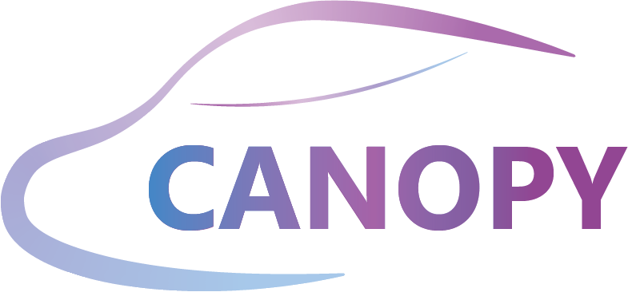
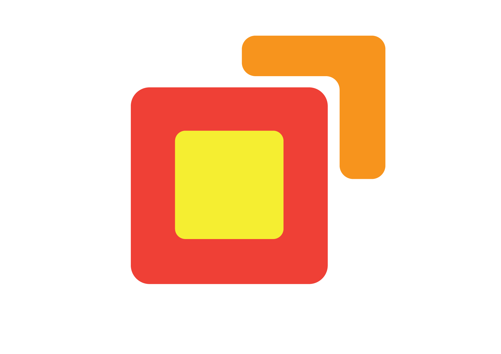
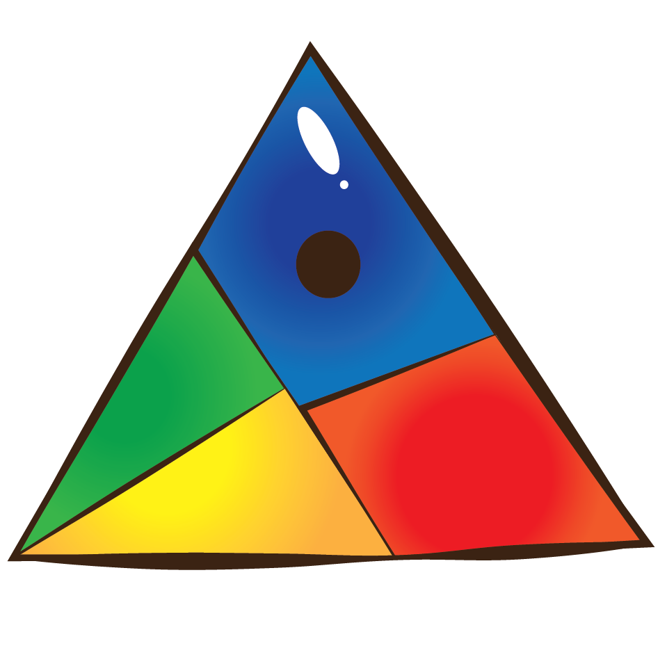

# Gameboy Emulator in C

  

  
  &nbsp;&nbsp;&nbsp;
  
  &nbsp;&nbsp;&nbsp;
  
  &nbsp;&nbsp;&nbsp;
  

Inspired, and nerd-sniped, by the community at [gbdev.io](https://gbdev.io/).
This is a version in pure C, with no external third-party dependencies, using my own libraries
for:
- windowing and events ([canopy](https://github.com/abnore/canopy) + what i need from [picasso](https://github.com/abnore/picasso)),
- sound (custom sound engine built on Apples Core Audio APIs, read [here](https://developer.apple.com/library/archive/documentation/MusicAudio/Conceptual/CoreAudioOverview/CoreAudioFrameworks/CoreAudioFrameworks.html) for an overview on the Core Audio frameworks)
- logging ([blackbox](https://github.com/abnore/blackbox)).

This will be a DMG (Dot Matrix Game, original GB) version for now, but will maybe move to
Color version later.

### Resources
- [awesome-gbdev](https://github.com/gbdev/awesome-gbdev)
- [gb pandocs](https://gbdev.io/pandocs/)
- [opcodes](https://gbdev.io/gb-opcodes/optables/)
- [icon](https://www.shareicon.net/gameboy-190630)
- [palette](https://lospec.com/palette-list/dmg-01-accurate)   
- [core audio](https://developer.apple.com/library/archive/documentation/MusicAudio/Conceptual/CoreAudioOverview/WhatisCoreAudio/WhatisCoreAudio.html)

>[!NOTE]
>This project is without any assistance from LLMs/AI, and is only for learning
>purposes. I am practicing reading documentation, and I am treating this as a puzzle I
>am solving for fun. There is no deadline, and no promise it will be good, or even finished!

